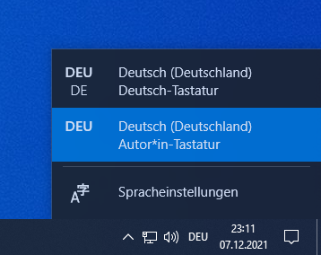

Deutsch-Autor ist ein erweitertes Tastaturlayout für Autoren, geboren aus der Verzweiflung, dass unter macOS
die tollen französischen Anführungszeichen einfach erreichbar sind, unter Windows aber nicht.

## Download & Installation

Die jeweils aktuelle Version ist auf der Liste der Releases des [Deutsch-Autor-Projekts](https://github.com/autorencommunity/deutsch-autor) zu finden:
[https://github.com/autorencommunity/deutsch-autor/releases/](https://github.com/autorencommunity/deutsch-autor/releases/).

Dort ist eine Zip-Datei zu finden. Diese muss entpackt werden und dann per `setup.exe` das Layout installiert werden.

## Layout aktivieren

Tastaturlayouts werden bei Windows spezifisch für jede Applikation gespeichert. In der Taskleiste kannst du zwischen `DEU` (das ist Deutsch-Autor) und `DEU-DE` (das ist die Standardtastatur)
umstellen. Das musst du immer dann umstellen, während du das Programm gerade im Vordergrund hast.

Falls du in Word schreibst, öffnest du am Besten ein leeres Dokument, klickst einmal in das Fenster, und dann direkt auf die Schaltfläche in der Taskleiste.

## Tastenbelegung

| Tastenkombination | Effekt |
| ----------- | ----------- |
| <kbd>AltGr</kbd>+<kbd>W</kbd> | « |
| <kbd>AltGr</kbd>+<kbd>Shift</kbd>+<kbd>W</kbd> | » |
| <kbd>AltGr</kbd>+<kbd>Shift</kbd>+<kbd>N</kbd> | ‹ |
| <kbd>AltGr</kbd>+<kbd>Shift</kbd>+<kbd>B</kbd> | › |
| <kbd>AltGr</kbd>+<kbd>-</kbd> | – (Halbgeviertstrich) |
| <kbd>AltGr</kbd>+<kbd>Shift</kbd>+<kbd>-</kbd> | — (Geviertstrich) |
| <kbd>AltGr</kbd>+<kbd>.</kbd> | … |
| <kbd>AltGr</kbd>+<kbd>Y</kbd>| ≤ |
| <kbd>AltGr</kbd>+<kbd>Shift</kbd>+<kbd>Y</kbd>| ≥ |
| <kbd>AltGr</kbd>+<kbd>Shift</kbd>+<kbd>+</kbd>| ± |
| <kbd>AltGr</kbd>+<kbd>Space</kbd> | non-breaking space / geschütztes Leerzeichen |
| <kbd>AltGr</kbd>+<kbd>Shift</kbd>+<kbd>-</kbd>| non-breaking hyphen / geschützter Bindestrich |
